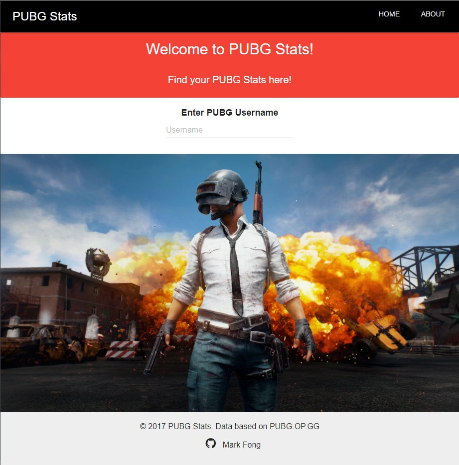
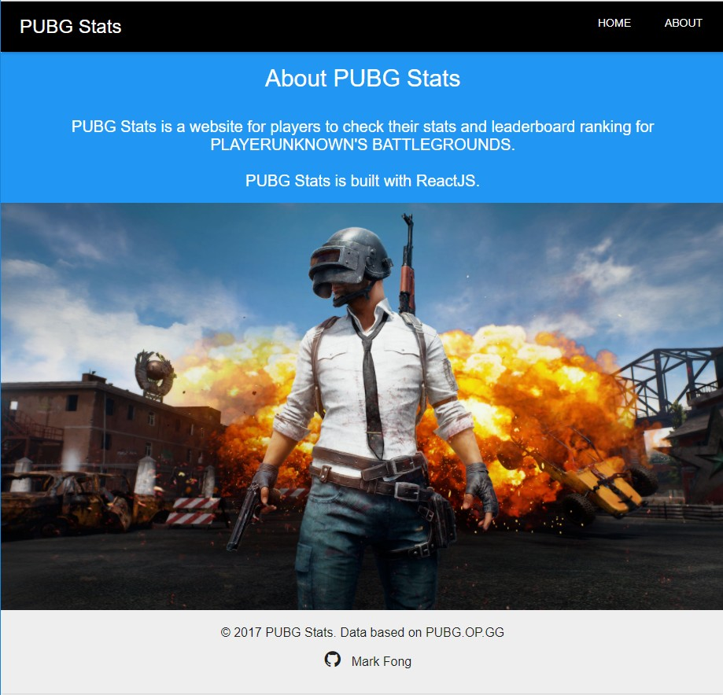
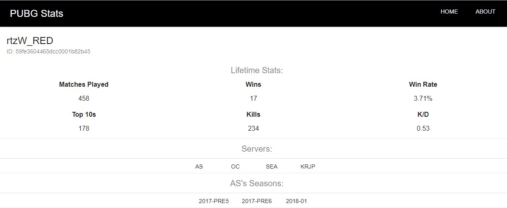
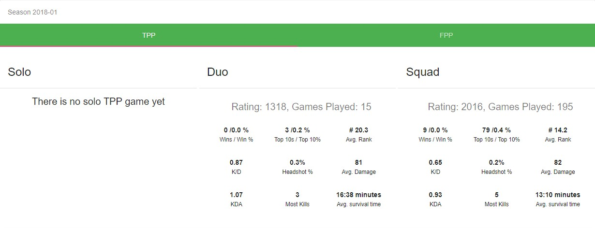
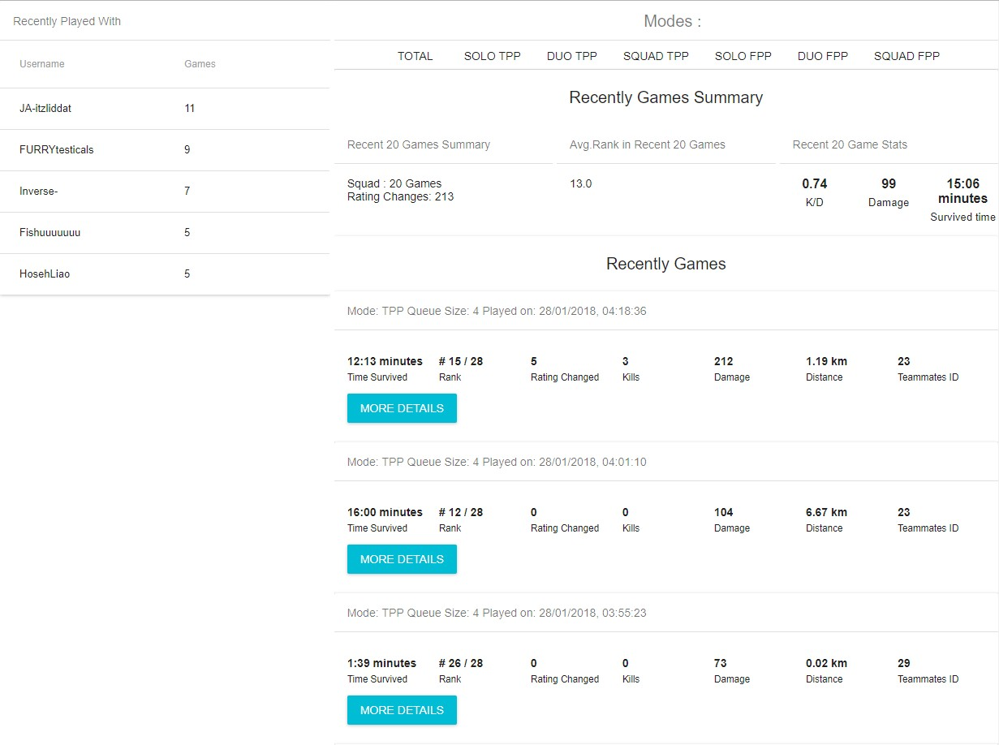
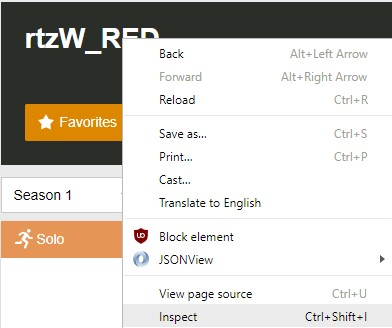
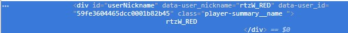
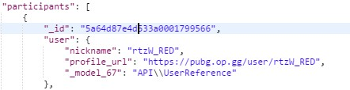

`*IMPORTANT*: The API is currently under maintenance for season 2018-02, which unfortunately means the player's stats for season 2018-02 could not be shown. Srver list has to be hardcoded as the latest API does not return the list of Server's played by a player.`

Pubgstats is a website that displays player's stats from Player's Unknown Battleground. The project is build with Express Node Backend + React Frontend + Material UI framework and the API originates from [PUBG op.gg](https://pubg.op.gg/).

To run the application, open 2 terminals, the first one run `npm install` and `node server` to start the NodeJS server.
 
On the second terminals, run `npm start` to start the react app.

Access the web application at `http://localhost:3000`.

Some Screenshots of the Web page:

Home Page



About Page



LifeTime Stats (Stats Page part 1)



Season Stats (Stats Page part 2)



Recent Played with Teammates and Games played (Stats Page part 3)



Note: 

1. Express Node integrated successfully with the React app created from [Create React App](https://github.com/facebookincubator/create-react-app).

2. Currently there are only a few endpoints to retrieve data from [PUBG op.gg API](https://pubg.op.gg/api):

```
Returns player profile details 
- /users/<PUBG op.gg's data user ID>/       
- Example: https://pubg.op.gg/api/users/59fe3604465dcc0001b82b45/ 

Returns player's stats for the particular server, season, mode, queue size
- /users/<PUBG op.gg's data user ID>/ranked-stats?server=<server name>&season=<season>&mode=<game mode>&queue_size=<queue size>       
- Example: https://pubg.op.gg/api/users/59fe3604465dcc0001b82b45/ranked-stats?server=as&season=2018-01&mode=tpp&queue_size=4

Returns player's recent played friendlist
- /users/<PUBG op.gg's data user ID>/matches/summary-played-with?server=<server name>&season=<season> 
- Example: https://pubg.op.gg/api/users/59fe3604465dcc0001b82b45/matches/summary-played-with?server=as&season=2018-01
     
Returns player's recent games (20)
- /users/<PUBG op.gg's data user ID>/matches/recent?season=<season>&server=<server name> 
- /users/<PUBG op.gg's data user ID>/matches/recent?season=<season>&server=<server name>&after=<offset of games>  
- /users/<PUBG op.gg's data user ID>/matches/recent?season=<season>&server=<server name>&mode=<game mode>&queue_size=<queue size>  
- /users/<PUBG op.gg's data user ID>/matches/recent?season=<season>&server=<server name>&mode=<game mode>&queue_size=<queue size>&after=<offset of games>
- Example: https://pubg.op.gg/api/users/59fe3604465dcc0001b82b45/matches/recent?season=2018-01&server=as
- Example: https://pubg.op.gg/api/users/59fe3604465dcc0001b82b45/matches/recent?season=2018-01&server=as&after=19
- Example: https://pubg.op.gg/api/users/59fe3604465dcc0001b82b45/matches/recent?season=2018-01&server=as&mode=tpp&queue_size=4
- Example: https://pubg.op.gg/api/users/59fe3604465dcc0001b82b45/matches/recent?season=2018-01&server=as&mode=tpp&queue_size=4&after=19

Returns match details 
- /users/<PUBG op.gg's data user ID>/       
- Example: https://pubg.op.gg/api/matches/2U4GBNA0Yml_fdeqrDDqxho56ZwCV4jz6tX-0lvOAlhz7qIPN280fRMwcwmCQ3F1
```

3. The search functionality of the website is not implemented, because I can't find the searching API. Enter `http://localhost:3000/player/59fe3604465dcc0001b82b45` in the browser to view the page. If you want to find other player's ID you will need to search a player's name in [PUBG op.gg](https://pubg.op.gg/), right click on the player's name as shown -> click on 'Inspect', the player's ID will be the `data-user-id`.





4. It's not possible to link to another player's profile due to the way PUBG op.gg implemented the player's ID differently in each API endpoint. For example, in this matches endpoint, https://pubg.op.gg/api/matches/2U4GBNA0YmkRC6lTqqSoYbNHyMRND3uBdHvtAg3Bzex5WprTokhFILlMwvM2n9a-, the participant ID for rtzW_RED is `5a64d87e4d533a0001799566`, which is totally different from the actual player ID `59fe3604465dcc0001b82b45`.

